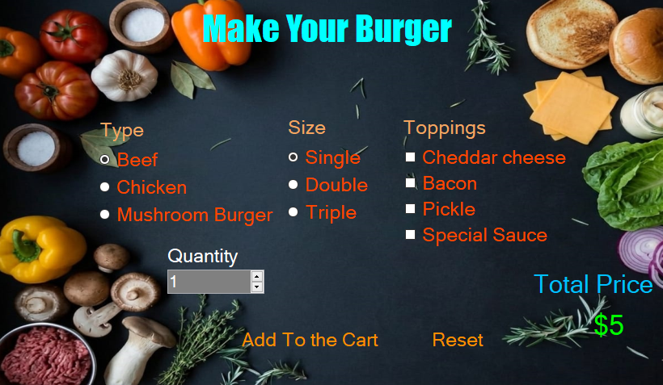

# 🍔 Customizable Burger Ordering System (Windows Forms)

A highly responsive and interactive Desktop Application built using C# and Windows Forms. This project serves as a standalone burger customization panel for a modern restaurant kiosk, applying structured backend logic, safe event handling, and real-time computation.

---

## 📸 Screenshots

---

## 🚀 Key Features

* Real-Time Price Calculation: Instantly updates the total order cost using dynamic compound price formulas whenever any selection (Burger Type, Size, or Toppings) is modified.
* Smart Quantity Multiplier: Supports multi-item bulk orders using a NumericUpDown controller, calculating the complete transaction cost seamlessly without hardcoded conditional blocks.
* Defensive Reset Lifecycle: Includes an encapsulation method (ResetButtons) that safely restores all controls to factory defaults, zeroes the quantity properly, and refreshes the base price layout immediately.
* Interactive UI States (UX/Hover Effects): Implements MouseEnter and MouseLeave custom events to dynamically handle button color transitions (Color.DarkOrange to Color.White), providing native feedback to user interaction.
* Order Flow Confirmation: Uses structured DialogResult controls to prompt confirmation pop-ups and info boxes before modifying or wiping form memory states.

---

## 🛠️ Technical Stack & Concepts Applied

* Language: C# (.NET Framework)
* UI Paradigm: Event-Driven Programming with Windows Forms
* Design Concepts: * Separation of Concerns (Isolating logic into discrete math functions like CalculateTypePrice, CalculateToppingsPrice, etc.)
  * Defensive Programming (Pre-loading current price layouts on Form_Load and defining precise numerical boundary thresholds)
  * Dynamic Object Data Mapping via Control .Tag variables.

---

## 📂 Code Architecture Highlight (Clean Price Compounding)

The pricing calculator leverages encapsulation instead of recursive functions or massive switch cases to scale the dynamic multiplication safely:

`csharp
int CalculateTotalPrice()
{
    int TotalPrice = CalculateTypePrice() + CalculateSizePrice() + CalculateToppingsPrice();
    return Convert.ToInt16(Qn.Value) * TotalPrice;
}

## Author
Jafr Jaber - GitHup Profile (https://github.com/jafr543)
