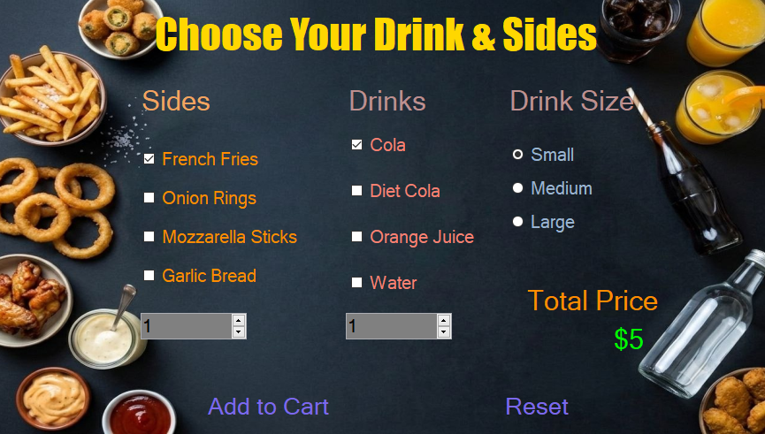

# 🥤 Drinks & Sides Customization Station (Windows Forms)

A dynamic and feature-rich Desktop Application component built using C# and Windows Forms. This module acts as the automated Beverage and Appetizer companion screen for a comprehensive restaurant self-service kiosk, engineered with modular math structures, responsive state management, and interaction verification filters.

---

## 📸 Screenshots

---

## 🚀 Key Features

* Dual-Quantity Compounding Pricing: Powered by an integrated multi-variable pricing algorithm that tracks, adds, and compounds individual item tags multiplied concurrently by dual NumericUpDown scaling inputs.
* Empty Order Prevention Filter: Implements an advanced structural check (ChecktheOrder) to dynamically intercept execution flows, blocking users from checkout operations if no items are selected.
* Pre-Load State Architecture: Configures secure operational parameters upon DrinksForm_Load by auto-selecting standard baseline items (Cola & French Fries) to optimize immediate rendering states.
* Fluid Slate-Blue Visual Transitions: Features custom high-responsiveness mouse tracking mechanics (MouseEnter / MouseLeave) to smoothly cycle button foreground colors into MediumSlateBlue states for elevated feedback.
* Complex Selection Matrices: Integrates flexible CheckBox controls to allow simultaneous selection profiles across multiple unique item groups (Drinks & Sides categories).

---

## 🛠️ Technical Stack & Concepts Applied

* Language: C# (.NET Framework)
* UI Paradigm: Event-Driven Programming with Windows Forms
* Design Concepts: 
  * Validation Guard Clauses (Intercepting blank orders before execution).
  * Compound Multi-Threaded Math Logic (Separating drink volume logic from side appetizers).
  * Control Object .Tag utilization to bind backend prices into UI parameters.

---

## 📂 Code Insight (Defensive Order Validation)

Instead of passing processing payloads directly to storage arrays, the engine verifies customer intent boundaries first to stop ghost orders:

`csharp
if(Result == DialogResult.OK)
{
    if(ChecktheOrder())
    {
        MessageBox.Show("You Can Not Order Nothing!", "Order Failed", MessageBoxButtons.OK, MessageBoxIcon.Error);
        return;
    }
    MessageBox.Show("Order Added Successfully", "Order Success", MessageBoxButtons.OK, MessageBoxIcon.Asterisk);
}

## Author Jafr Jaber - GitHup(https://github.com/jafr543)
