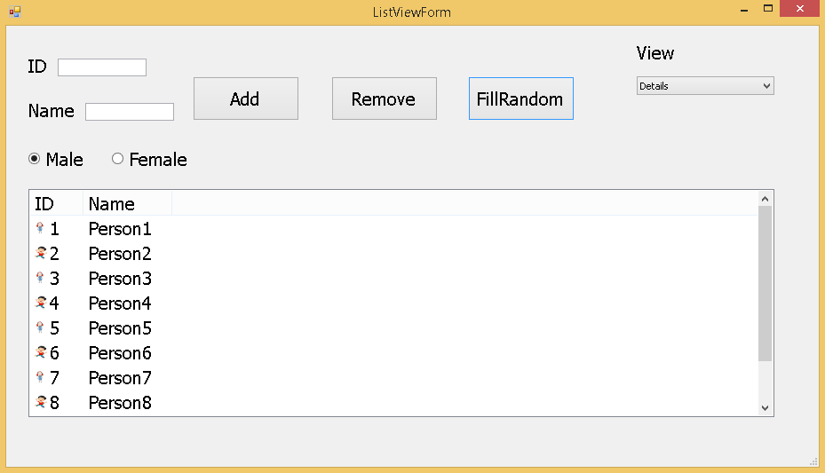

## 📸 Screenshots

 
 
 using System;
using System.Collections.Generic;
using System.ComponentModel;
using System.Data;
using System.Drawing;
using System.Linq;
using System.Text;
using System.Threading.Tasks;
using System.Windows.Forms;

namespace Trining
{
    public partial class ListViewForm : Form
    {
        public ListViewForm()
        {
            InitializeComponent();
        }

        private void btnAdd_Click(object sender, EventArgs e)
        {
            if (string.IsNullOrEmpty(txtID.Text) || string.IsNullOrEmpty(txtName.Text))
                return;
            
                ListViewItem item = new ListViewItem(txtID.Text.Trim());
                if(rbMale.Checked)
                {
                    item.ImageIndex = 0;
                }
                else
                {
                    item.ImageIndex = 1;
                }

                item.SubItems.Add(txtName.Text.Trim());
                LV1.Items.Add(item);

                txtID.Clear();
                txtName.Clear();
                txtID.Focus();
            
        }

        private void btnRemove_Click(object sender, EventArgs e)
        {
            if (LV1.Items.Count <= 0)
                MessageBox.Show("Fill is Empty!");

                
            else if (LV1.SelectedItems.Count <=0 )
            
                MessageBox.Show("Pleas Select item To Remove");
            
            else
                LV1.Items.Remove(LV1.SelectedItems[0]);
                
        }

        private void button2_Click(object sender, EventArgs e)
        {
            for (int i = 1; i <= 10; i++)
            {
                ListViewItem item = new ListViewItem((i.ToString()));
                if (i % 2 == 0)
                    item.ImageIndex = 0;
                else
                    item.ImageIndex = 1;

                item.SubItems.Add("Person" + i);
                LV1.Items.Add(item);
            }
        }

        private void comboBox1_SelectedIndexChanged(object sender, EventArgs e)
        {
            int Selecteditem = comboBox1.SelectedIndex;

            switch(Selecteditem)
            {
                case 0: LV1.View = View.Details;
                 break;

                case 1: LV1.View = View.SmallIcon;
                    break;

                case 2: LV1.View = View.LargeIcon;
                    break;

                case 3: LV1.View = View.List;
                    break;

                case 4: LV1.View = View.Tile;
                    break;
            }
        }

        private void ListViewForm_Load(object sender, EventArgs e)
        {
            comboBox1.SelectedIndex = 0;
        }
    }
}
