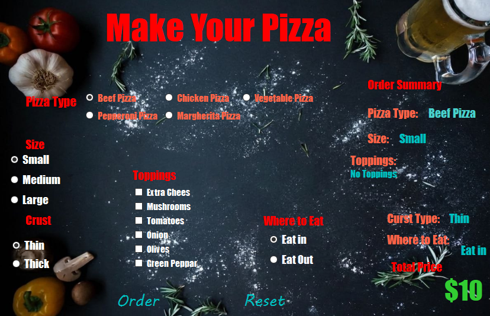

# 🍕 Pizza Ordering System (Windows Forms)

A dynamic, visually appealing Desktop Application built using C# and Windows Forms. This project simulates a digital kiosk or ordering screen for a premium pizzeria, focusing on responsive UI data-binding, clean event-driven logic, and clean code principles.

---

## 📸 Screenshots

---

## 🚀 Key Features

* Dynamic Receipt & Live Tracking: The order summary panel updates instantly whenever the user modifies their pizza configuration (Size, Crust, Toppings, or Dining location).
* Smart Topping Formatting: Implements architectural safety filters using advanced C# string manipulations (TrimEnd / length boundaries) to dynamically format comma-separated strings without broken leading commas or runtime memory exceptions.
* Property Tag Utilization: Separates business data from hardcoded variables by leveraging UI control .Tag properties to safely map financial parameters and values.
* Confirmation & Reset Flow: Fully automated operational cycle consisting of interactive MessageBox receipts, complete UI states freeze post-order, and automated factory-reset defaults.
* ​Multiple Pizza Varieties: Added a custom panel to select between dynamic pizza bases (Beef, Chicken, Margherita, Pepperoni, and Vegetable), each mapped to its own unique base price.
---

## 🛠️ Technical Stack & Concepts Applied

* Language: C# (.NET Framework)
* UI Paradigm: Event-Driven Programming with Windows Forms
* Design Concepts: * Defensive Programming (Edgecase Bug-Hunting: avoiding ArgumentOutOfRangeException)
  * Data/UI separation using control Tags.
  * Structural formatting and string builders.

---

## 📂 Code Insight (Dynamic String Architecture)

Instead of traditional messy conditional appending, the toppings selection relies on robust backend data trimming:

// Used to cleanly manage user choices without leaving orphan commas
laSelectedToppings.Text = sToppings.TrimEnd(',', ' ');

## Author
Jafr Jaber - GitHub Profile(https://github.com/jafr543)
